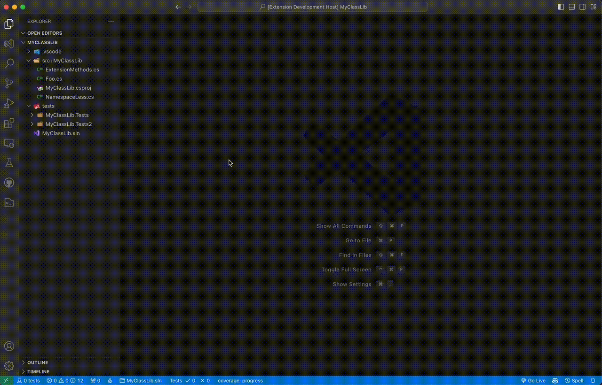

## Features

Generate C# Xunit test class files for C# files or entire C# projects.

If test-driven development (TDD) wasn't followed initially, use Development-Driven Testing (DDT) to generate test classes and test methods to increase code coverage and decrease technical debt. Or, use DDT while practicing TDD to generate boilerplate test classes and test methods.

## Requirements

- C# project with a test project.
    - Test projects must have property `IsTestProject` set to `true` to be recognized as a test project.
    - Multiple test projects are supported.
- Tech debt; missing unit tests. 🤷🏼‍♂️

## Known Issues/Limitations

Most, if not all, of the following you can append "... (for now)". As in, these will be addressed.

- Does not account for (as in include) public methods on base classes.
- Does not take advantage of interfaces used on classes.
- Uses constructor with most parameters.
- Not using mocks where applicable.
